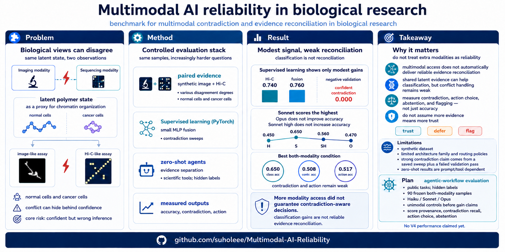

# Multimodal AI Reliability in Biological Research

Combining multiple experimental techniques is the gold standard of biological research, but it carries a hard challenge: different experimental modalities often tell different truths. This project asks whether AI can be trusted to reconcile that disagreement. Using a synthetic chromatin system observed through paired image-like and Hi-C-like measurements, it tests two questions — (1) does a multimodal dataset improve AI classification, and (2) can AI reliably recognize and reconcile contradiction between modalities? Across supervised baselines, zero-shot LLM API calls, and terminal-based agentic workflows, the answer to both is largely no. The headline is a counterintuitive one: **more information did not lead to better performance**, and **more capable models did not do better**.

<p align="center">
  
</p>

<p align="center"><em>Graphical abstract. <strong>Problem:</strong> a microscopy-like image and a Hi-C-like contact map observe the same latent polymer — a proxy for normal vs. cancer chromatin — yet the two views can disagree. <strong>Method:</strong> a controlled evaluation stack tests supervised classifiers, zero-shot LLM API calls, and terminal-based agents on classification, contradiction detection, and reconciliation action. <strong>Result:</strong> multimodal access gives only modest, inconsistent gains, and contradiction and action accuracy stay near chance across model scale. <strong>Takeaway:</strong> more information does not guarantee better performance — reliable AI-for-biology must detect contradiction and decide when to trust, defer, or flag.</em></p>

## Motivation

Combining experimental techniques is the gold standard of biological research, but different modalities frequently disagree. Two structural facts make this unavoidable:

- You generally **cannot apply different experimental techniques to the same cells simultaneously**, so each modality measures a slightly different physical sample.
- You often **cannot directly compare readouts across modalities**, because they are incomparable by nature.

This is why clinicians built multidisciplinary forums such as **tumor boards** — venues whose entire purpose is to reconcile measurements that do not line up. Reliable reconciliation of modalities is therefore not a nicety but a prerequisite for safe and effective AI-for-biology.

This project tackles two questions:

1. **Can using a multimodal experimental dataset improve AI's performance?**
2. **Can AI reliably recognize and reconcile contradictory situations between different experimental modalities?**

## The Synthetic System

To study these questions without dataset-collection confounds, the repository uses a designed synthetic polymer system that resembles either **normal** or **cancer** chromatin. Cancer chromatin is known to adopt a more condensed topology, so cancer-like polymers are generated with added attractive interactions that compact their structure.

Each polymer is then observed through two linked experimental modalities derived from **the same shared latent conformation**:

- an **image-like optical rendering**, mimicking a microscopy image
- a **sequencing-like contact map**, mimicking Hi-C

Because both views come from one underlying polymer, modality disagreement can be introduced and measured in a controlled way. AI systems are asked to classify each sample as normal vs. cancer under three input conditions: **image only**, **Hi-C only**, and **both modalities**.

## Supervised Baselines

To establish a baseline for this classification task on the synthetic dataset, supervised PyTorch classifiers were trained on each input condition (small CNN/MLP encoders with late-fusion concatenation, trained with cross-entropy). The pattern is clear:

- all three conditions classified **significantly above chance** (chance = `0.500`)
- but **naive fusion did not improve classification accuracy meaningfully**

In the saved five-seed baseline (`results/reports/final_results_summary.txt`), the best fusion variant reached `0.760 ± 0.034` test accuracy versus `0.740 ± 0.047` for Hi-C-only and `0.655 ± 0.042` for image-only. Fusion edged out the best single modality by only `~0.02` — a modest difference, not evidence of robust multimodal complementarity. The supervised baseline thus answers question (1) skeptically before LLMs are even introduced: combining modalities is not automatically better.

## LLM Evaluation: Adding the Contradiction Dimension

The study then moves to LLMs, using **three Claude models of increasing capability — Haiku 4.5, Sonnet 4.6, and Opus 4.7**.

For the LLM tests, a new dimension was added to the dataset: **contradiction**. These are cases where the image and Hi-C evidence tend to point in different directions (e.g., the image looks like normal chromatin while the Hi-C map looks cancerous). Based on contradiction level, the **both-modalities** dataset is composed of:

- **⅓ well-matching** data (modalities agree)
- **⅓ weak-contradiction** data
- **⅓ strong-contradiction** data

This makes reconciliation, not just classification, central to the task. Beyond classification accuracy, two reliability metrics are measured:

- **Contradiction accuracy** — whether the LLM correctly flags contradictory cases
- **Action accuracy** — for flagged cases, whether the LLM acts correctly to reconcile the contradiction (trust the more reliable modality, use both, or abstain)

### Zero-Shot API Test (V3)

The first LLM test used direct API calls with **no task context (zero-shot)**, relying primarily on naive visual inspection of the PNG-format data. The final clean results, over matched seeds `21..40`:

| Model | Image only | Hi-C only | Both modalities | Contradiction acc | Action acc |
| --- | ---: | ---: | ---: | ---: | ---: |
| Claude Haiku 4.5, none | `60/120 = 0.500` | `66/120 = 0.550` | `60/120 = 0.500` | `64/120 = 0.533` | `64/120 = 0.533` |
| Claude Opus 4.7, none | `61/120 = 0.508` | `68/114 = 0.596` | `71/120 = 0.592` | `52/120 = 0.433` | `59/120 = 0.492` |
| Claude Sonnet 4.6, high | `63/120 = 0.525` | `67/120 = 0.558` | `69/120 = 0.575` | `56/120 = 0.467` | `64/120 = 0.533` |
| Claude Sonnet 4.6, none | `58/120 = 0.483` | `66/120 = 0.550` | `78/120 = 0.650` | `61/120 = 0.508` | `62/120 = 0.517` |

Three key findings:

1. **No consistent multimodal gain.** Most models classify both-modality inputs at roughly single-modality levels; there is no significant increase from having both modalities.
2. **Contradiction and action accuracy hover near chance.** The reconciliation metrics fluctuate around `0.5` and never establish reliable contradiction detection.
3. **Higher capability does not help.** Scaling from Haiku to Opus does not improve any of the measured accuracies.

Because this test relied on naive visual inspection of PNGs, a more rigorous analysis might in principle change the result — which motivates the next experiment.

### Terminal-Agent Test (V4)

The same dataset was then evaluated with a **terminal-based agentic workflow (Claude Code)**, authorized to use any necessary Python libraries, and run on a **doubled polymer size** (`N = 48 → 96`) for finer structure. Instead of eyeballing PNGs, the agents wrote their own analysis code — for example, **computing the aspect ratio of the masked polymer image**, or **comparing diagonal vs. off-diagonal intensities of the Hi-C contact map** (PIL + NumPy, occasionally SciPy).

The compact final run `v4_compact_20260509T032302Z` scored `810` outputs (`90` samples × `3` models × `3` conditions):

| Model | Image only | Hi-C only | Both modalities | Contradiction acc | Action acc |
| --- | ---: | ---: | ---: | ---: | ---: |
| Haiku | `40/90 = 0.444` | `45/90 = 0.500` | `56/90 = 0.622` | `28/90 = 0.311` | `29/90 = 0.322` |
| Sonnet | `43/90 = 0.478` | `45/90 = 0.500` | `51/90 = 0.567` | `30/90 = 0.333` | `34/90 = 0.378` |
| Opus | `50/90 = 0.556` | `45/90 = 0.500` | `47/90 = 0.522` | `29/90 = 0.322` | `30/90 = 0.333` |

Despite the more sophisticated, quantitative analysis methods and the larger polymers, **the results remained similar**: classification gains from both modalities are small and inconsistent, contradiction and action accuracy stay low (`~0.31–0.38`), and the strongest model (Opus) is not the best reconciler. The run is complete and parse-clean (`810/810` scored, no malformed outputs, no timeouts).

## What This Means

The surprising point this project emphasizes is that **"more information does not lead to better performance,"** at least for AI applied to biological research. The common belief in AI-for-biology and AI-for-medicine is that *data is king*. This study suggests a correction: **"how to reconcile existing data" is as important as "collecting more data."**

Equally striking, **better models did not show better performance.** Capability scaling from Haiku to Sonnet to Opus did not improve classification, contradiction detection, or reconciliation action. This points to a **fundamental gap in LLMs' biological reasoning over multimodal datasets that capability scaling alone does not close.**

## Limitations

The main limitations concern the dataset:

- **It is a synthetic benchmark with over-represented features.** Realistic evaluation needs **real paired image and Hi-C datasets that share the same cell state**, ideally measured by the same laboratory.
- **The polymer is too small** to capture the subtle features that distinguish normal from cancer chromatin. This study used `N = 96` monomers due to computational cost, whereas actual chromosomes are on the `~10^6` base-pair scale.

Beyond the dataset, the LLM evaluation itself can be improved substantially. Well-framed prompts and **few-shot tasks** (e.g., explicitly providing the Python libraries widely used to analyze images and Hi-C maps), together with **sweeps over reasoning levels and temperature**, would give a more systematic and robust picture.

Additional methodological notes: V3 is zero-shot and prompt/tool dependent, and its `thinking=high` setting is confounded with Anthropic's required `temperature=1.0`; V3 Opus Hi-C-only is reported as `n=114` because one seed stopped early; V4 is a terminal-agent product benchmark rather than a deterministic model-API benchmark, so its findings should not be treated as prompt-invariant.

## What's Needed Next

If a more systematic design on **real datasets** still confirms these pilot results, the obvious next step is: **how do we make AI systems detect contradictions and decide when to trust, defer, or flag, as they process multimodal data?** This is a load-bearing capability for building safe and reliable AI-for-biology.

Concretely:

- Test this benchmark on **real biological data** — candidate paired datasets can be found through the [4DN Data Portal](https://data.4dnucleome.org).
- Develop algorithms for **efficient reconciliation** that process conflicting information without collapsing to one modality or over-trusting superficial agreement.
- Move beyond one-shot classification toward agent benchmarks that require explicit evidence provenance, abstention, contradiction recall, and a justified choice of which modality to trust.

A personal view: closing the reconciliation gap will likely require **interpretability experiments — from chain-of-thought analysis to finer mechanistic tools — to fully understand and improve how LLMs reconcile multimodal evidence.**

## How to Reproduce

### Setup

```bash
python -m venv .venv
source .venv/bin/activate
pip install -r requirements.txt
```

### Data

No external dataset is bundled. The released experiments generate synthetic paired data at runtime from the polymer sandbox. See `data/README.md` for the expected repository convention.

### Run the supervised baseline

```bash
python scripts/finalize_reproducible_evaluation.py
```

This writes baseline artifacts under `results/final/` and `results/reports/`.

### Run the contradiction-focused regime analysis

```bash
python scripts/run_v2_phase_diagram.py --profile default --no-show
```

For a faster smoke run:

```bash
python scripts/run_v2_phase_diagram.py --profile debug --no-show
```

This writes figures, reports, and tables under `results/v2/`.

### Run a zero-shot V3 agent benchmark

The V3 runner is mock-safe by default:

```bash
python scripts/run_v3_agent_benchmark.py --profile smoke --mock
```

A single real-API V3 smoke run for the final scientific-tool condition looks like:

```bash
python scripts/run_v3_agent_benchmark.py \
  --profile smoke \
  --model claude-sonnet-4-6 \
  --input-condition both_modalities \
  --prompt-policy evidence_separation \
  --tool-level scientific \
  --thinking none \
  --seed 21 \
  --real-api \
  --confirm-api-call
```

The final V3 release repeats this over seeds `21..40`, model/thinking settings, and clean unimodal conditions (`--input-condition image_only` and `--input-condition hic_only`).

### Summarize the final V3 agent benchmark

```bash
python scripts/summarize_v3_agent_runs.py \
  results/v3/final_model_sweep/scientific_20260505T201217Z \
  results/v3/scientific_tools/sonnet_evidence_sep_20260505T175124Z \
  results/v3/final_reasoning/sonnet_scientific_high_20260505T203622Z \
  results/v3/final_unimodal_clean/scientific_20260506T021839Z
```

See `docs/v3_agent_benchmark.md` for the exact run commands and `results/v3/final/README.md` for the curated final result.

### Reproduce the V4 terminal-agent evaluation

V4 evaluates Claude Code on clean public task folders. The final compact run
used `90` frozen samples and high effort for Haiku, Sonnet, and Opus. Build a
new task set with:

```bash
RUN_ID="v4_compact_$(date -u +%Y%m%dT%H%M%SZ)"
PUBLIC_ROOT="${TMPDIR:-/tmp}/v4_public_tasks/$RUN_ID"

python scripts/build_v4_agent_tasks.py \
  --profile compact_final \
  --run-id "$RUN_ID" \
  --public-root "$PUBLIC_ROOT" \
  --evaluator-root "results/v4/evaluator/$RUN_ID" \
  --conditions all

python scripts/run_v4_terminal_agent_benchmark.py \
  --task-root "$PUBLIC_ROOT" \
  --output-root "results/v4/runs/${RUN_ID}_both" \
  --models haiku,sonnet,opus \
  --conditions both_modalities \
  --effort high \
  --resume

python scripts/run_v4_terminal_agent_benchmark.py \
  --task-root "$PUBLIC_ROOT" \
  --output-root "results/v4/runs/${RUN_ID}_unimodal" \
  --models haiku,sonnet,opus \
  --conditions image_only,hic_only \
  --effort high \
  --resume

python scripts/evaluate_v4_agent_outputs.py \
  "results/v4/runs/${RUN_ID}_both" \
  "results/v4/runs/${RUN_ID}_unimodal" \
  --hidden-manifest "results/v4/evaluator/$RUN_ID/hidden_manifest.jsonl" \
  --output-dir "results/v4/evaluations/${RUN_ID}_full_clean"
```

See `docs/v4_terminal_agent_benchmark.md` for the dry-run, preflight, resume,
and usage-limit handling protocol. The completed final run is summarized in
`results/v4/final_analysis_report.md`.

## Included Results

- supervised baseline summary: `results/reports/final_results_summary.txt`
- supervised baseline plots:
  - `results/final/final_accuracy_summary.png`
  - `results/final/final_contradiction_summary.png`
- contradiction-regime figure: `results/v2/figures/v2_contradiction_sweep.png`
- contradiction-regime reports:
  - `results/v2/reports/v2_main_findings.txt`
  - `results/v2/reports/v2_validation_report.txt`
  - `results/v2/reports/v2_observability_pass_negative_result.txt`
- contradiction-regime tables:
  - `results/v2/tables/v2_sweep_metrics.csv`
  - `results/v2/tables/v2_sweep_summary.csv`
  - `results/v2/tables/v2_validation_metrics.csv`
- final V3 zero-shot agent summary:
  - `results/v3/final/README.md`
  - `results/v3/final/final_metrics.csv`
  - `results/v3/final/paired_deltas.csv`
  - `results/v3/final/prediction_bias_summary.csv`
- final V4 terminal-agent summary:
  - `results/v4/README.md`
  - `results/v4/final_analysis_report.md`
  - `results/v4/evaluations/v4_compact_20260509T032302Z_full_clean/summary.csv`
  - `results/v4/evaluations/v4_compact_20260509T032302Z_full_clean/paired_deltas.csv`
  - `results/v4/evaluations/v4_compact_20260509T032302Z_full_clean/confusion.json`

## License

MIT. See `LICENSE`.
